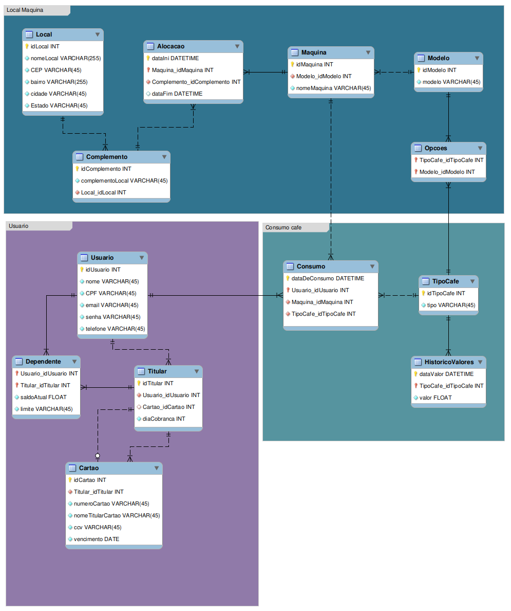

<p align="center"></p>

## Vinicius Figueiró Tonini
> Esse repositório contém a resolução do primeiro projeto prático da disciplina de Banco de Dados (BCD29008).

**Sumário**
- [Introdução](#introdução)
- [Modelo do projeto](#modelo-do-projeto)
- [Executando o projeto](#executando-o-projeto)
  - [Conexão com o banco de dados](#conexão-com-o-banco-de-dados)
  - [Container docker MySQL](#container-docker-mysql)
  - [Executar a aplicação](#executar-a-aplicação)
- [Endpoints e exemplos](#endpoints-e-exemplos)
- [Requisitos atendidos](#requisitos-atendidos)
- [Consumindo os Endpoints com Curl](#consumindo-os-endpoints-com-curl)
  - [Rotas: Usuário](#rotas-usuário)
  - [Rotas: Consumo](#rotas-consumo)
  - [Rotas: Alocação](#rotas-alocação)
  - [Rotas: Histórico Valor](#rotas-histórico-valor)
- [Limitações do projeto](#limitações-do-projeto)
- [Entregas do projeto](#entregas-do-projeto)

## Introdução 

A _startup_ CaféOni, tem como objetivo ofertar um novo produto no mercado que consiste na disponibilização de máquinas automáticas de café em locais com grande fluxo de pessoas, como instituições de ensino, empresas, shopping, academias, condomínios etc.

Pretendemos trabalhar com diferentes modelos de máquinas, sendo que a diferença entre cada modelo está na variedade de tipos de café que ela opera.

## Modelo do projeto



## Executando o projeto

Para executar a aplicação, é necessário fazer o clone deste repositório e estar no diretório `projetoBcd`, para isso, execute os seguintes comandos:

```sh
git clone https://github.com/BCD29008-classroom/2023-01-projeto-pratico-viniciusft81.git
cd projetoBcd/
```
Em seguida, utilize a configuração atual da conexão com o banco de dados ou utilize um container docker.

### Conexão com o banco de dados

A conexão com o banco de dados é feita através do arquivo [application.propertis](./projetoBcd/src/main/resources/application.properties) e pode ser usada conforme abaixo. 

```properties
spring.datasource.url=jdbc:mysql://ampto.sj.ifsc.edu.br:3306/projetovinicius
spring.datasource.username=vinicius
spring.datasource.password=bcd2023.01
spring.datasource.driver-class-name=com.mysql.jdbc.Driver

spring.jpa.hibernate.ddl-auto=create
```
> **Obs.:** Em caso de utilizar um container docker, o arquivo de propriedades deve ser alterado.

### Container docker MySQL

Caso não tenha um servidor `MySQL` é possível subir um container usando Docker com o seguinte comando:

```sh
docker run -d --rm -p 3306:3306 -e MYSQL_ROOT_PASSWORD=senhaRoot -e MYSQL_DATABASE=projetobcd -e MYSQL_USER=projeto -e MYSQL_PASSWORD=projeto -e MYSQL_ROOT_HOST='%' --name projetobcdmysql mysql/mysql-server:latest
```

### Executar a aplicação

A aplicação desenvolvida em `Java` realiza o povoamento da banco de dados, dessa forma, basta apenas executar a classe [CafeteiraOniRunner.java](./projetoBcd/src/main/java/engtelecom/bcd/projetoBcd/CafeteiraOniRunner.java) em uma IDE ou executar a tarefa gradle dentro do diretório `projetoBcd`:

```sh
./gradlew bootRun
```

> **Obs.:** Certifique-se de estar no diretório `projetoBcd` onde o arquivo `gradlew` está presente para que a tarefa seja executada corretamente.

## Endpoints e exemplos

| Método | Endpoint | Descrição do serviço |
|--------| -------- | -------------------- |
| GET | localhost:8080/alocacao-maquina?maquina=1 |Lista todas as alocações de uma máquina |
| GET | localhost:8080/usuarios | Lista todos os usuários |  
| GET | localhost:8080/consumo-por-dia?mes=6 |Lista o total de café consumido em determinado mês agrupado por dia |
| GET | localhost:8080/listaConsumos |Lista os consumos de todos os usuários |
| GET | localhost:8080/consumo-usuario-tipo?mes=6 |Lista o total de café consumido em determinado mês agrupado por tipo e usuário |
| GET | localhost:8080/historicoTitular?titular=2|Lista o histórico de consumo do titular|
| GET | localhost:8080/historicoDependente?titular=1|Lista o histórico de consumo do dependente|
| GET | localhost:8080/consumo-por-local?mes=6|Lista o total de café consumido em determinado mês agrupado por local de consumo|
| GET | localhost:8080/tempo-alocacao?maquina=1&complemento=1|Lista o tempo de uma máquina alocada em um local com base nas datas de inicio e de fim|
| POST | localhost:8080/adicionarUsuario | Adiciona um novo usuário |  
| POST | localhost:8080/moveMaquina | Adiciona a máquina em uma nova alocação |  
| POST | localhost:8080/addConsumo | Adiciona um novo consumo |  
| POST | localhost:8080/alteraValorCafe | Adiciona o novo valor de café para algum tipo existente |
| POST | localhost:8080/adicionaCartao| Adiciona um novo cartão |  
| POST | localhost:8080/addConsumoTitular | Adiciona um novo consumo com um usuário titular |  
| POST | localhost:8080/adicionarDependente | Adiciona um novo dependente para o usuário titular | 
| PUT | localhost:8080/alteraLimiteDependente | Titular pode modificar o valor do limite atual de seu dependente |  
| PUT | localhost:8080/atualizaCartaoTitular | Titular atualiza seu cartão preferencial |  

Foi elaborado um exemplo de uso para consumir os endpoints, basicamente, é criado um novo usuário, esse usuário é definido como `titular` na criação e inicialmente não poderá fazer consumos, pois não tem um cartão cadastrado. Dessa forma, é simulado o consumo de um titular após cadastrar um cartão. 

Abaixo é apresentado algumas `Query` criada para consumo:
```java
@RepositoryRestResource(collectionResourceRel = "consumo", path = "consumo")
public interface ConsumoRepository extends CrudRepository<Consumo, ConsumoId> {

    @Query("select 'Total de cafés consumidos em determinado mes agrupados por dia' as total, 'cafes:' as cafe, count(*), 'dia:' as dia, day(idConsumo.dataDeConsumo) from Consumo where month(idConsumo.dataDeConsumo) = ?1 group by day(idConsumo.dataDeConsumo)")
    List<Object[]> totalCafeConsumidoEmUmMesPorDia(Integer mes);

    @Query(value = "select u.nome, tc.tipo, 'Total cafes:' as t, COUNT(*) AS total_cafes FROM consumo c JOIN tipo_cafe tc ON c.id_tipo_cafe = tc.id_tipo_cafe JOIN usuario u ON c.id_usuario = u.id_usuario WHERE month(c.data_de_consumo) = ?1 GROUP BY tc.tipo, u.nome", nativeQuery = true)
    List<Object[]> totalcafeConsumidoEmUmMesPorTipoEUsuario(Integer mes);

    @Query(value = "select 'Gastos no Mes:' as m, month(c.data_de_consumo), 'Valor:' as v, max(hv.valor) from consumo c join tipo_cafe tc on tc.id_tipo_cafe = c.id_tipo_cafe join historico_valores hv on tc.id_tipo_cafe = hv.id_tipo_cafe join usuario u on u.id_usuario = c.id_usuario where c.id_tipo_cafe = hv.id_tipo_cafe and c.data_de_consumo >= hv.data_valor and u.id_usuario = ?1 group by data_de_consumo", nativeQuery = true)
    List<Object[]> valorTotalMensalPorUsuario(Integer mes);
    
    @Query(value = "select 'Local:' as loc, l.nome_local, 'Cafes:' as cafe, COUNT(*) as total_cafes from consumo c join maquina m on m.id_maquina = c.id_maquina join alocacao a on m.id_maquina = a.id_maquina join local l on l.id_local = a.id_complemento where MONTH(c.data_de_consumo) =  ?1 group by l.nome_local;", nativeQuery = true)
    List<Object[]> totalCafePorLocal(Integer mes);

    @Query(value = "select u.nome, tc.tipo, hv.valor, c.data_de_consumo from consumo c join usuario u on c.id_usuario = u.id_usuario join tipo_cafe tc on tc.id_tipo_cafe = c.id_tipo_cafe join historico_valores hv on tc.id_tipo_cafe = hv.id_tipo_cafe", nativeQuery = true)
    List<Object[]> listaConsumos();
}
```

## Requisitos atendidos
- [x] Maquina pode ser movida para outra alocação
- [x] É possível alterar preço do café
- [x] Permite consultar o histórico de alocações por maquina
- [x] Permite consultar o tempo de uma maquina em um local
- [x] Permite criar conta de usuário e definir como titular e criar dependente para o titular
- [x] Permite cadastrar cartões e o titular pode definir cartão primário
- [x] Permite o consumo de café identificando o usuário
- [x] Permite consultar o histórico de consumo por usuário
- [x] Permite o titular consultar seu próprio histórico e de seu dependente
- [x] Titular pode aumentar o limite do dependente
- [x] Gera relatório do total de café consumido em determinado mês, agrupado por tipo de café e usuário
- [x] Gera relatório do total de café consumido em determinado mês, agrupado por dia
- [x] Gera relatório do total de café consumido em determinado mês, agrupado por local de consumo
- [ ] Gera o total das últimas N faturas

## Consumindo os Endpoints com Curl

Para consumir os recursos, é necessário utilizar o `curl`, abaixo estão alguns exemplos de uso.

### Rotas: Usuário 
- Adicionar novo usuário 

```sh
curl -XPOST -H "Content-type: application/json" -d '{
	"nome": "emerson",
  "email": "emerson@email.com",
  "cpf": "678.990.335-09",
  "telefone": "(48)98888-0999",
  "senha": "87654321"
}' 'http://localhost:8080/adicionarUsuario'
```
  Resultado esperado:
  ```bash
  Usuario adicionado com sucesso
  ```

- Adicionar novo cartão para o usuário titular criado
 
```sh
curl -XPOST -H "Content-type: application/json" -d '{
	"titular": 2,
  "numCartao": "7777888899990000",
  "cvv": "888"
}' 'http://localhost:8080/adicionaCartao'
```
  Resultado esperado:
  ```bash
  Cartão adicionado com sucesso
  ```

- Um titular que possui dependente pode alterar o limite de seu dependente
> O que não é o caso de nosso usuário recém criado anteriormente, visto que o mesmo não possui dependente ainda.

```sh
curl -XPUT -H "Content-type: application/json" -d '{
	"titular": 1,
	"novoLimite": 220.30
}' 'http://localhost:8080/alteraLimiteDependente'
```
  Resultado esperado:
  ```bash
  Limite alterado com sucesso
  ```
- Alterando o cartão de nosso usuário titular recém criado

```sh
curl -XPUT -H "Content-type: application/json" -d '{
	"titular": 2,
	"cartao": 2
}' 'http://localhost:8080/atualizaCartaoTitular'
```
  Resultado esperado:
  ```
  Cartão do titular foi atualizado com sucesso
  ```
- Listar todos os usuários 

```sh
curl -XGET 'http://localhost:8080/usuarios'
```
  Resultado esperado:
  ```
  Documento json com os usuários cadastrados
  ```

- Adicionar dependente para o novo usuário titular 
```sh
curl -XPOST -H "Content-type: application/json" -d '{
	"titular": 2,
	"usuario": 2,
	"saldo": 50.00,
	"limite": 50.00
}' 'http://localhost:8080/adicionarDependente'
```
  Resultado esperado:
  ```
  Dependente adicionado com sucesso
  ```

### Rotas: Consumo
- Adicionar novo consumo para um usuário
```sh
curl -XPOST -H "Content-type: application/json" -d '{
	"usuario": 1,
	"tipo": 2,
	"maquina": 1
}' 'http://localhost:8080/addConsumo'
```

  Resultado esperado:
  ```bash
  Novo consumo adicionado
  ```
- Adicionar um novo consumo como usuário titular

```sh
curl -XPOST -H "Content-type: application/json" -d '{
	"usuario": 2,
	"tipo": 7,
	"maquina": 1
}' 'http://localhost:8080/addConsumoTitular'
```

  Resultado esperado:
  ```bash
  Novo consumo adicionado
  ```

- Listar o total de café consumido em um mês agrupado por dia

```sh
curl -XGET 'http://localhost:8080/consumo-por-dia?mes=6'
```
  Resultado esperado:
  ```bash
  [
	[
		"Total de cafés consumidos em determinado mes agrupados por dia",
		"cafes:",
		1,
		"dia:",
		20
	]
  ]
  ```
- Listar todos os consumos dos usuários

```sh
curl -XGET 'http://localhost:8080/listaConsumos'
```
  Resultado esperado:
  > É esperado retornar uma lista com o nome do usuário, tipo de café consumido, preço do café e data do consumo. Conforme exemplo:

  ```bash
  [
	[
		"Trinidad Klocko",
		"Expresso pequeno",
		3.25,
		"2023-03-30T01:04:57.730+00:00"
	],
	[
		"emerson",
		"Mocha pequeno",
		4.63,
		"2023-06-25T17:20:32.353+00:00"
	]
  ]
  ```

- Listar o total de café consumido em um mês agrupado por tipo de café e por usuário

```sh
curl -XGET 'http://localhost:8080/consumo-usuario-tipo?mes=6'
```
  Resultado esperado:
  ```bash
 [
	[
		"Lesley Hoppe",
		"Expresso pequeno",
		"Total cafes:",
		1
	]
  ]
  ```
  
- Listar o total de café consumido em um mês agrupado por local de consumo

```sh
curl -XGET 'http://localhost:8080/consumo-por-local?mes=6'
```
  Resultado esperado:
  ```bash
 [
	[
		"Local:",
		"IFSC",
		"Cafes:",
		1
	]
 ]
  ```

- Listar o histórico de consumo do titular

```sh
curl -XGET 'http://localhost:8080/historicoTitular?titular=2'
```
  Resultado esperado:
  > É esperado uma lista com todos os consumos do usuário titular.
  ```bash
 [
	[
		"emerson",
		"Expresso medio",
		3.63,
		"2023-06-24T22:44:08.610+00:00"
	]
  ]
  ```

- O titular pode listar o histórico de consumo do dependente

```sh
curl -XGET 'http://localhost:8080/historicoDependente?titular=1'
```
  Resultado esperado:
  > É esperado uma lista com todos os consumos do dependente do titular com id=1.
  ```sh
 [
	[
		"Dependente de:",
		"Trenton Klein",
		4.55,
		220.3,
		150.0,
		"2023-04-13T03:10:13.020+00:00"
	]
  ]
  ```

### Rotas: Alocação
- Mover a máquina para outra alocação
```sh
curl -XPOST -H "Content-type: application/json" -d '{
	"maquina": 1,
	"complemento": 2
}' 'http://localhost:8080/moveMaquina'
```

  Resultado esperado:
  ```bash
  Maquina movida com sucesso
  ```

- Lista as alocações de uma máquina, a última da lista é onde ela se encontra atualmente

```sh
curl -XGET 'http://localhost:8080/alocacao-maquina?maquina=1'
```

  Resultado esperado:
  > É esperado a seguinte listagem para a máquina com id=1. O null representa a data-fim, ou seja, a máquina está neste local atualmente.
  ```bash
 [
	[
		"2023-06-25T22:54:47.259+00:00",
		"Cozinha",
		"IFSC",
		"Maquina avançada",
		"Data fim:",
		"2023-06-25T22:55:04.150+00:00"
	],
	[
		"2023-06-25T22:55:04.150+00:00",
		"Sala professores",
		"UFSC",
		"Maquina avançada",
		"Data fim:",
		null
	]
]
  ```
  
- Lista o tempo de uma máquina em uma alocação

```sh
curl -XGET 'http://localhost:8080/tempo-alocacao?maquina=1&complemento=1'
```

  Resultado esperado:
  ```bash
[
	[
		"Maquina avançada",
		"2019-06-07T06:05:05.000+00:00",
		"2023-06-25T23:08:46.422+00:00",
		"Dias alocada:",
		1479
	]
]
  ```

### Rotas: Histórico Valor
- Alterar valor de um tipo de café existente
> É utilizado o método `POST` pois adiciona uma nova linha na coluna com o novo preço do café

```sh
curl -XPOST -H "Content-type: application/json" -d '{
	"tipo": 2,
	"preco": 11.50
}' 'http://localhost:8080/alteraValorCafe'
```

  Resultado esperado:
  ```
   Valor do cafe alterado com sucesso
  ```

## Limitações do projeto

- O consumo do dependente não foi adicionado, com isso, quando o titular consulta o histórico de consumo do dependente, mostra do usuário titular.
- Não foi gerado via `Rest` as últimas N faturas.
- Quando deixa o banco de dados do arquivo [properties](./projetoBcd/src/main/resources/application.properties) em `update` ocorre um pequeno erro com as entidades `Cartão` e `Titular`, o erro envolve HashCode, porém o `EqualsAndHashCode` estão `exclude` em ambas as entidades. Como resultado, o banco de dados deve ficar com a flag `spring.jpa.hibernate.ddl-auto=create`.

## Entregas do projeto

- [Modelagem do banco de dados](./modelagem.png)
- [Correção da Modelagem do banco de dados](./modelagem_corrigida.png)
- [Aplicação Rest com Java](./projetoBcd/)
